# Programming paradigms

## Functional programming

Ознакомьтесь с материалами

Материалы:
- [Функциональное программирование в JavaScript с практическими примерами](https://habr.com/ru/company/mailru/blog/327522/)
- [Функторы, аппликативные функторы и монады в картинках](https://habr.com/ru/post/183150/)

## OOP

1. Изучите основы ООП
2. Изучите основы типизации на Typescript
3. Спроектируйте систему службы доставки, используя нотацию UML (диаграмма классов, диаграмма прецедентов), прикрепите изображения диаграмм к сторе в комментарии, свяжитесь с тренером и обсудите их
4. Реализуйте систему службы доставки, используя принципы ООП и Typescript, в соответствии с построенными и согласованными с тренером диаграммами

----

✅ Task 09.1: Служба Доставки

Реализовать Систему службы доставки для взаимодействия 3 типов Пользователей: Администратора, Курьера и Заказчика. Для этого сначала спроектировать и затем написать классы на Typescript с использованием наследования. Система должна выполнять следующие функции:
- Автоматическая регистрирация нового Пользователя при получении Заказа от Заказчика, если Пользователя с таким телефоном ещё нет
- Автоматическое назначение на новый Заказ Курьера, у которого меньше всего Заказов на определённый день (исключать из подсчёта количества Заказы со статусом "Отменён")
- Автоматическая смена статуса Заказа с "Ожидание" на "Доставка" в момент наступления 10:00 того дня, на который назначена доставка этого Заказа
- Создание Чата для общения Заказчика с Курьером по запросу Заказчика, если для Заказчика с указанным телефоном найден Заказ с указанным трекинг номером и статусом "Ожидание" или "Доставка". В ином случае сообщать Заказчику об ошибке

Возможности Заказчика:
- Создание нового Заказа – Письма или Посылки. При этом Заказчик заполняет поля формы и получает информацию о стоимости доставки
  - Для Письма обязательные поля: телефон, адрес отправления, адрес доставки
  - Для Письма необязательные поля: имя, e-mail
  - Для Письма стоимость доставки фиксированная - 300 рублей
  - Для Посылки обязательные поля: как и для письма плюс габариты (ширина, длина, глубина от 20 до 2000 см) и вес (от 0.1 до 100 кг)
  - Для Посылки необязательные поля: как и для письма плюс пометка "Хрупкий груз"
  - Для Посылки стоимость доставки рассчитывается по формуле: `КОРЕНЬКВАДРАТНЫЙ((БАЗОВАЯСТОИМОСТЬ + ХРУПКИЙГРУЗ) * (ШИРИНА + ВЫСОТА + ГЛУБИНА + ВЕС * БАЗОВАЯСТОИМОСТЬ))`, где `БАЗОВАЯСТОИМОСТЬ` - фиксирована и равна 500 рублей, `ХРУПКИЙГРУЗ` - 0 или 200 рублей, `ШИРИНА` `ВЫСОТА` `ГЛУБИНА` в сантиметрах, `ВЕС` в килограммах
- После создания посылки ей присваивается уникальный трек-номер и предоставляется Заказчику
- Статус только что созданного Заказа – "Ожидание"
- Запрос статуса Заказа по трек-номеру, полученному при его создании
- Переписка с Курьером по Заказу в Чате. Для создания Чата необходимо указать трек-номер Заказа и свой телефон. Если Заказчик уже общался в Чате по этому Заказу, то он должен увидеть историю переписки
- Отмена Заказа в статусе "Ожидание" (перевод в статус "Отменён")
  
Возможности Курьера:
- Просмотр списка Заказов, назначенных ему на определённую дату. Список можно фильтровать по дате и по подстроке одного из полей адреса (адрес отправления, адрес доставки), либо по обоим сразу
- Переписка с Заказчиками в Чатах, которые создаются по инициативе Заказчика и скрываются после успешного выполнения доставки. При этом чаты продолжают храниться в Системе
- Изменение статуса Заказа с "Доставка" на "Выполнен"
- Откладывание Заказа со статусом "Ожидание" на следующий день
  
Возможности Администратора:
- Создание нового Пользователя
- Редактирование данных существующего Пользователя
- Просмотр списка всех Пользователей с возможностью фильтрации по указанной роли (Администратор/Курьер/Заказчик)
- Просмотр списка Заказов с возможностью фильтрации по указанному Заказчику, Курьеру, дате доставки, статусу Заказа
- Редактирование данных Заказа
- Просмотр любого Чата Заказчика с Курьером
  
Пояснения:
- Служба доставки работает только в пределах города и выполняет доставку одним днём. Случаи, когда Курьер забирает Заказ в один день, а доставляет в другой - не рассматриваются
- Служба доставки принимает оплату только при вручении Заказа Курьером, поэтому реализация логики оплаты в Системе не требуется и не рассматривается
- При успешном создании чата Система создаёт сессию для поддержания его активности. Сессия истекает по прошествию 10 минут после последнего сообщения от Заказчика, либо по причине закрытия чата
- В задаче раздела Layout - Adaptive layout описывается UI, с помощью которого Пользователи будут работать с Системой

Папка для задачи: **09-oop-delivery-system**

Примечание:
  Пример реализации внешнего API:
```javascript
  class Test {
      publicMethod1() {}
      publicMethod2() {}
      publicMethod3() {}
      privateMethod1() {}
    
      getAPI() {
          return {
              publicMethod1: this.publicMethod1.bind(this),
              publicMethod2: this.publicMethod2.bind(this),
          };
      }
  }
```

В этом примере `const test = new Test()` вернёт инстанс, который предоставляет полный доступ к публичным свойствам и методам владельцу интерфейса. А `test.getAPI()` вернёт ограниченный набор методов, предназначенный для использования внешним пользователем интерфейса.

---- 

Материалы:
- [Plantuml download link](https://sourceforge.net/projects/plantuml/) (описание диаграмм дано ниже)
- [Основы ООП](https://habr.com/ru/post/147927/)
- [10 принципов ООП](https://habr.com/ru/company/skillbox/blog/454314/)
- [S.O.L.I.D-ый JavaScript (видео)](https://youtu.be/wi3wPzReKZQ)
- [Объектно-ориентированный JavaScript для начинающих](https://developer.mozilla.org/ru/docs/Learn/JavaScript/Objects/Object-oriented_JS)
- [Typescript: Basic Types](https://www.typescriptlang.org/docs/handbook/basic-types.html)
- [Typescript: Interfaces](https://www.typescriptlang.org/docs/handbook/interfaces.html)
- [Typescript: Classes](https://www.typescriptlang.org/docs/handbook/classes.html)
- [Typescript: Generics](https://www.typescriptlang.org/docs/handbook/generics.html)
- [Typescript: Decorators](https://www.typescriptlang.org/docs/handbook/decorators.html)

### PlantUML

**PlantUML** - это инструмент, позволяющий быстро и просто создавать UML диаграммы.
**UML (Unified Modeling Language)** был придуман для того, чтобы генерировать из схем код. Поэтому схема должна отражать то, что будет впоследствии реализовано, даже если она является лишь вспомогательным инструментом.

#### Общие положения
1. Любая диаграмма PlantUML начинается с команды `@startuml` и заканчивается на `@enduml`.
2. Для добавления заголовка в диаграмму используется атрибут `title`.
3. Для форматирования диаграммы используется атрибут `skinparam`.

#### Диаграмма классов
**Диаграмма классов** описывает типы данных, имеющихся в системе, и взаимосвязи между ними.

##### Класс
Символ класса на диаграмме может выглядеть по-разному в зависимости от требуемого уровня детализации.


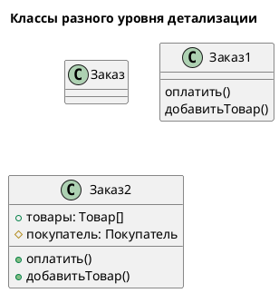

У каждого класса есть:
* название – единственный обязательный параметр класса. Должен быть уникален в рамках диаграммы. Всегда является существительным в именительном падеже;
* свойства – параметры, отражающие состояние класса. Формат спецификации атрибута:  
  `видимость имя : тип [кратность] = значение_по_умолчанию`
* методы – действия, которые класс может совершить. Формат спецификации метода:
  `видимость имя(аргумент: тип) = тип_возвращаемого_значения`

С точки зрения видимости метод/свойство класса может быть:
* приватным (private, доступен только внутри класса) — задается символом минус (-), может отображаться в виде квадрата;
* защищенным (protected, доступен внутри класса, а также внутри классов-наследников) — задается символом решетка (#), может отображаться в виде ромба;
* открытым (public, доступен всем) — задается символом плюс (+), может отображаться в виде круга.

**ВАЖНО!** Указанные форматы спецификаций содержат максимально детализированную информацию о методах и атрибутах класса. Использование каждого сегмента формата определяется уровнем детализации диаграммы и не является обязательным.

Важной частью диаграммы классов являются отношения между классами. Выделяют несколько видов таких отношений, мы рассмотрим основные из них.

###### Отношение Ассоциация
Эта связь показывает _взаимоотношения_ между классами. Обычно это привязка одного класса к другому, реализованная через:
* хранение инстанса одного класса в поле другого;
* использование одного класса в методе другого.


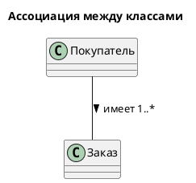

На линии, соединяющей два класса, можно написать глагол, отображающий суть их связи. Направление связи может быть указано стрелкой (< или >) в пояснении.

Тут же можно указать кратность связи: у одного покупателя может быть много заказов, но один заказ принадлежит только одному покупателю. Это связь "один ко многим". Она обозначается как 1…*.

###### Отношение Наследование
Эта связь используется для отображения взаимоотношений _родитель-наследник_ между классами. Полая стрелка всегда идёт от наследника к родителю.


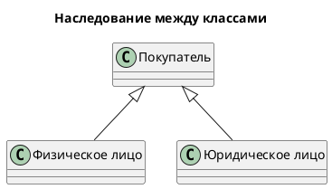

Такие стрелки обычно не подписывают, поскольку связь всегда имеет один и тот же характер.

###### Уровни детализации
В зависимости от задачи моделирования, диаграмма классов может иметь разный уровень детализации:
1. **Концептуальная модель системы** включает в себя основные сущности, реализующие поставленную задачу. У классов на такой диаграмме обязательно будут названия, можно добавить им свойства и описание обязанностей. Чёткое определение необходимых методов, типов данных свойств и т.п.  
   На такой диаграмме обязательно обозначаются связи между классами.  Диаграмму такого уровня детализации можно использовать в качестве "словаря системы" - она закрепляет основные понятия, набор ключевых сущностей и связи между ними.
2. **Диаграмма уровня проектирования** – это модель, наиболее близкая к последующей реализации, то есть к коду. Такая диаграмма може быть использована для кодогенерации.
   По сути – это концептуальная модель с полным атрибутным составом класса (методами и свойствами). Тут будет важно дать полное описание каждому атрибуту – видимость, типы данных и прочее.
3. **Диаграмма-эскиз** сосредотачивается на конкретной части системы, которая на данный момент представляет интерес. Для объяснения логики работы части системы обычно нет смысла погружаться в реализацию всей системы.
   Такая диаграмма может строиться вокруг одного класса – он будет описан подробно, а связанные с ним классы могут быть описаны просто именем (если их атрибуты в рамках данной задачи не имеют значения).

##### Диаграмма прецедентов (вариантов использования, use case)
**Диаграмма вариантов использования** (_англ. use-case diagram_) описывает какая функциональность разрабатываемой программной системы доступна определённым группам пользователей.

###### Пользователь
**Группа пользователей** отображается в виде человечка. Под человечком записывается название группы пользователей.


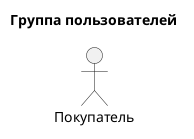

С помощью параметра диаграммы skinparam actorStyle можно изменить стиль отображения пользователей на диаграмме. В рамках одной диаграммы допустимо использование только одного стиля отображения пользователей:
* вид по умолчанию – палка-палка-огуречик;
* похожий на снежинку человечек, используемый в этом документе – hollow;
* в виде бюста – awesome.

###### Вариант использования
Функция системы (**вариант использования**) записывается в эллипс. Для её названия используется глагол и несколько пояснительных слов (например, "Отправить задание на проверку").


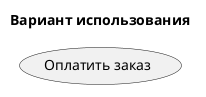

###### Отношение Ассоциация
Пользователь, имеющий доступ к соответствующей функции, соединяется с ней прямой линией. Такой тип отношения называется **"ассоциация".**


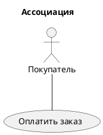

Если несколько пользователей имеют доступ к одной и той же функции, PlantUML объединит эти варианты использования в один (главное, дать им одно и то же название):


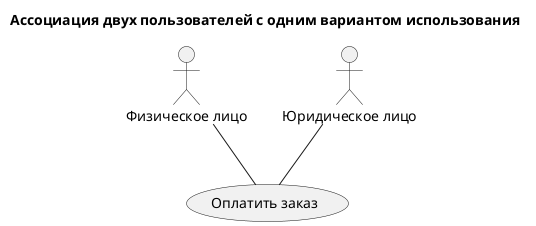

Нотация позволяет использовать ряд других отношений для упрощения читаемости диаграммы.

Обратите внимание – не стоит перебарщивать с использованием этих связей. Применяйте их только тогда, когда это действительно оправдано. Чем проще диаграмма, тем лучше.

###### Отношение Обобщение
Такая связь используется для сокращения дублирования связей между сущностями диаграммы с помощью объединения нескольких частных случаев в один общий. Стрелка всегда направляется от частного случая к общему.

Этот тип связи можно использовать для объединения пользователей:


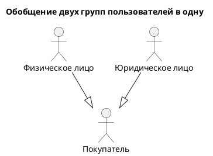

Или же для объединения вариантов использования:


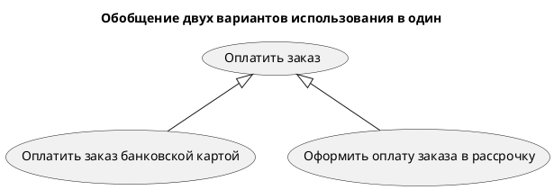

Таким образом, вместо диаграммы с кучей пересечений мы получаем читаемую схему с понятными связями:


###### Отношение Включение
Такая связь используется, чтобы показать, что один вариант использования является составной частью другого варианта использования. Отношение включения обозначается пунктирной линией с V-образной стрелкой на конце, над стрелкой добавляется надпись “include”. Стрелка направляется к включаемому варианту использования.


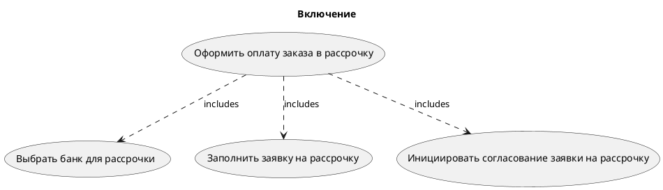

**ВАЖНО!** После двоеточия в конце строки можно написать любой текст, который будет отображаться на стрелке.

###### Отношение Расширение
Отношение расширения обозначает, что есть необязательные варианты использования, которые могут быть включены в основной. обозначается пунктирной линией с V-образной стрелкой на конце (похоже на отношение включения), над стрелкой добавляется надпись “extend ”. Стрелка направляется к основному варианту использования.

Хорошим примером такой связи являются дополнительные услуги, которые зачастую предлагают в магазинах техники:


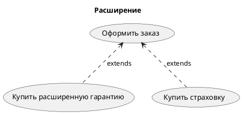
